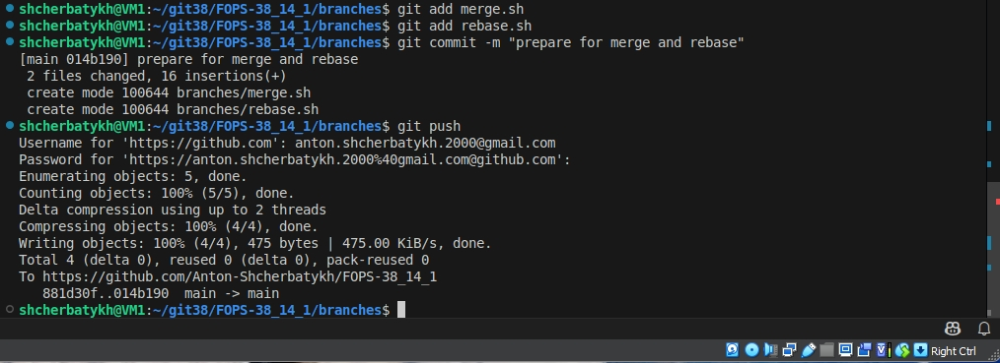
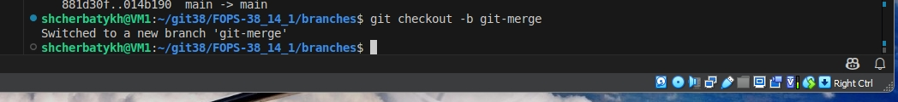
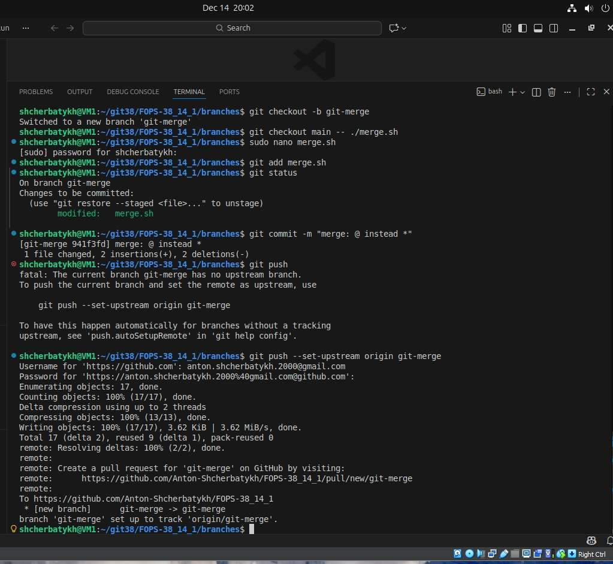
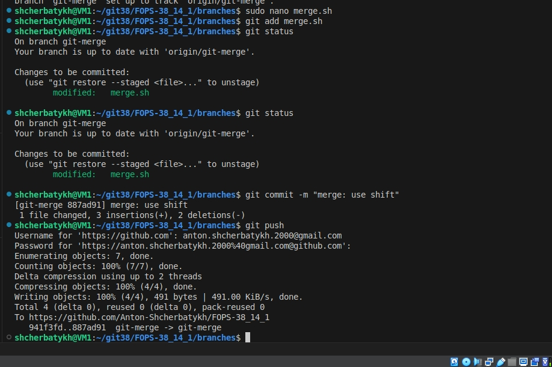
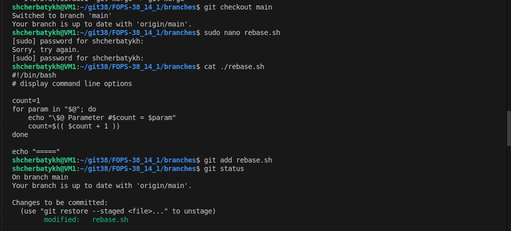
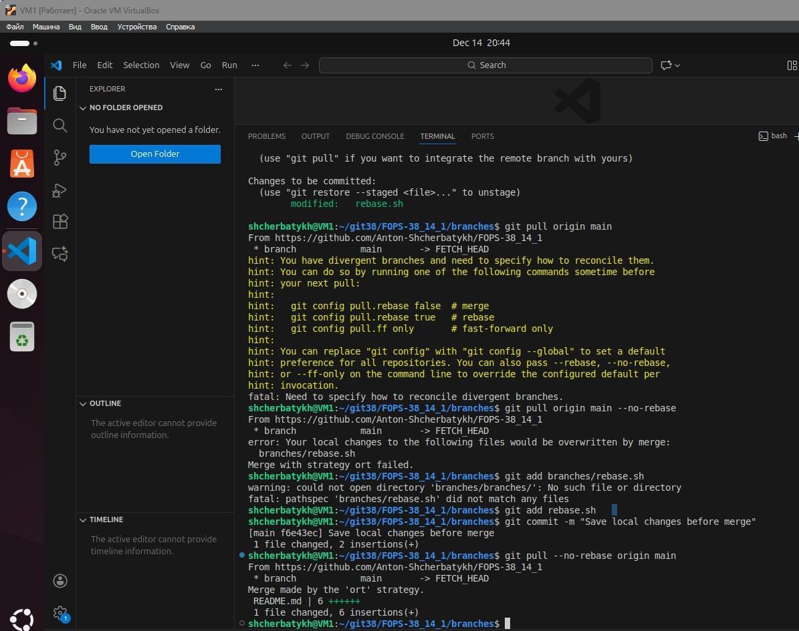
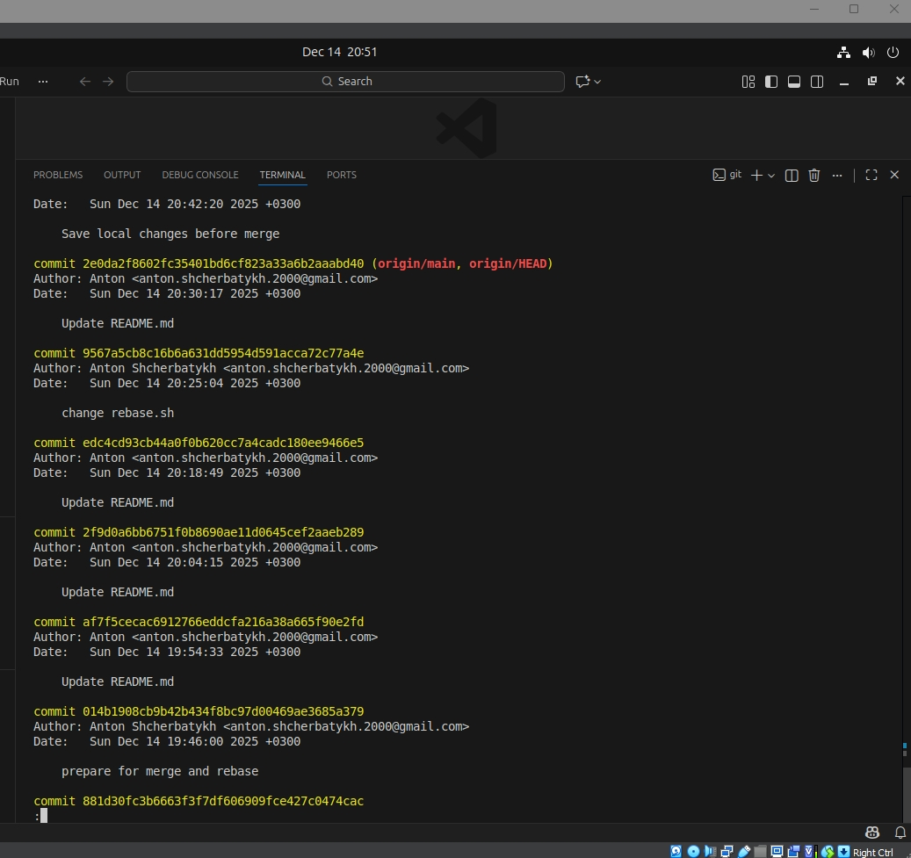
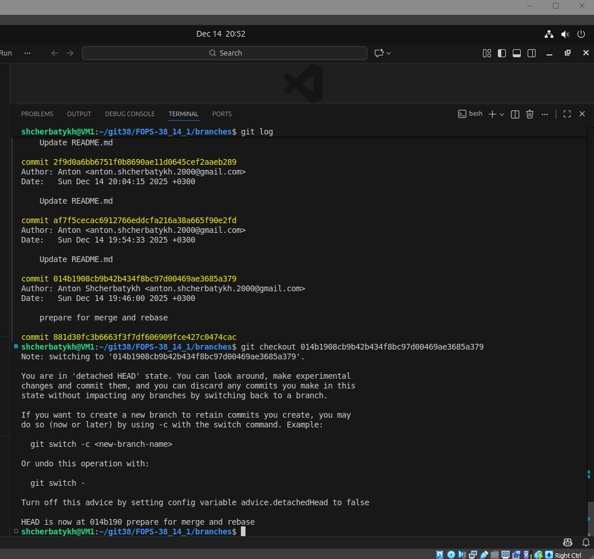
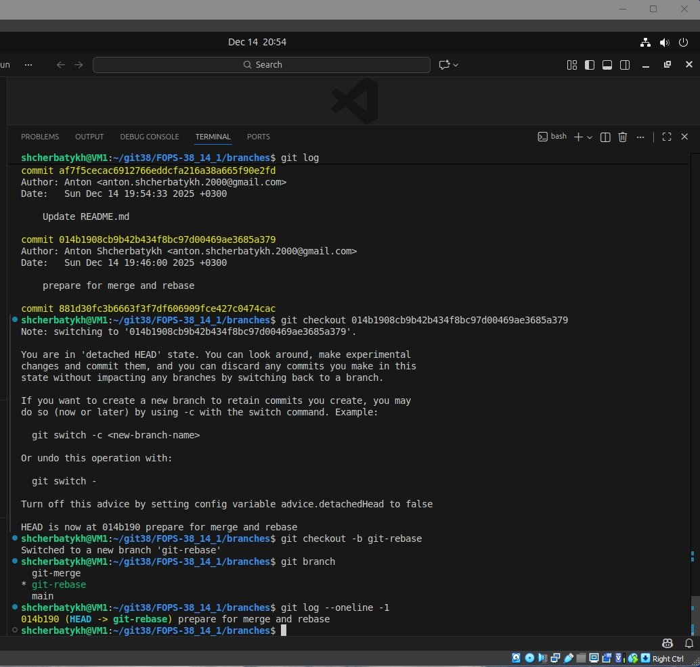

## Домашнее задание к занятию «Ветвления в Git» Щербатых А.Е. FOPS-38

### Задание «Ветвление, merge и rebase» 

**Шаг 1.** Создал каталог branching и файлы merge.sh и rebase.sh



#### Подготовка файла merge.sh
**Шаг 1.** Создал ветку ```git-merge```



**Шаг 2.** Заменил в ней содержимое файла ```merge.sh``` согласно заданию

**Шаг 3.** Создал коммит "merge: @ instead *" и запушил изменения в репозиторий



**Шаг 4.** Вношу ещё одни изменения в файл ```merge.sh```

**Шаг 5.** Создаю коммит ```merge: use shift``` и отправляю изменения в репозиторий:



#### Изменим ```main```

**Шаг 1.** Вернулся в ветку ```main```. (команда отражена на скрине в следующем шаге)

**Шаг 2.** Изменил содержимое файла rebase.sh



**Шаг 3.** Отправил изменения в ветку main:



#### Подготовка файла rebase.sh

**Шаг 1.** С помощью команды git log нахожу хеш коммита ```prepare for merge and rebase``` и выполняю ```git checkout``` на него:






