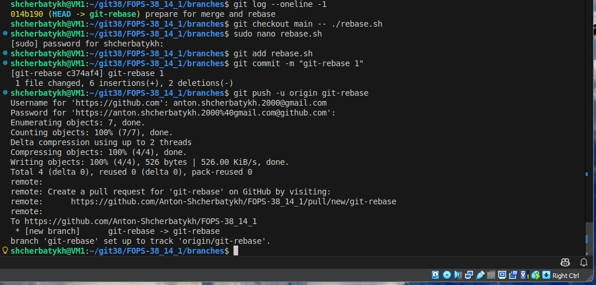
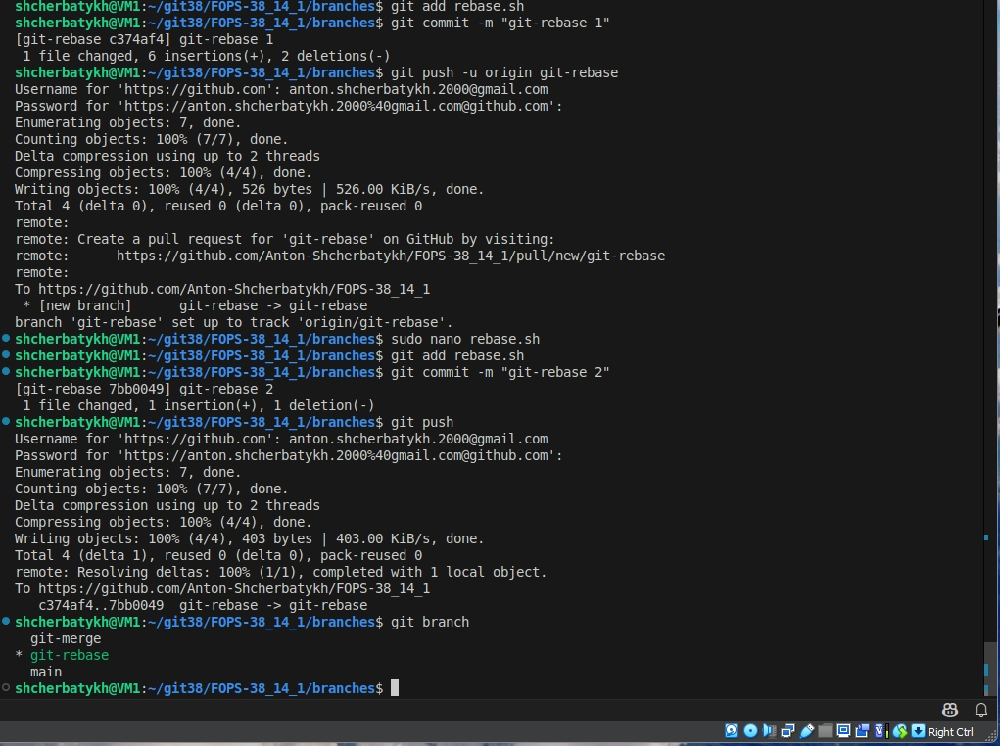
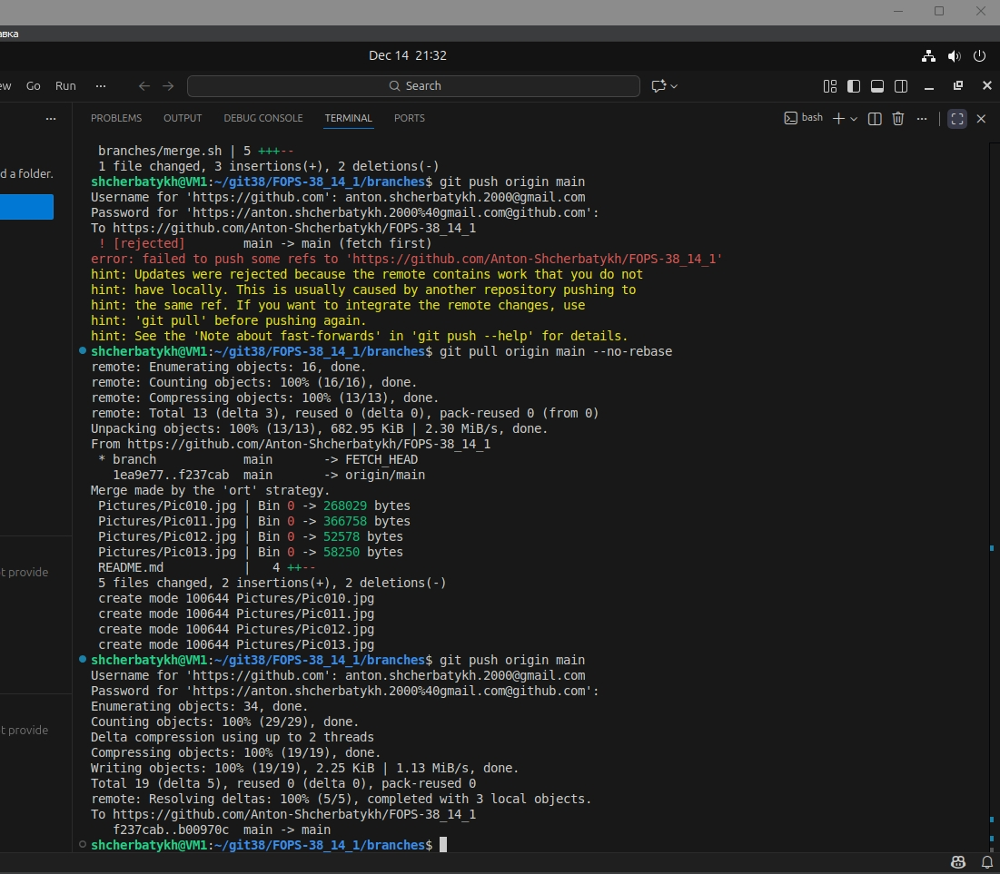
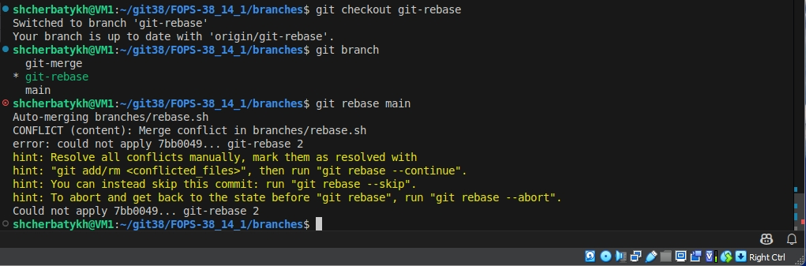
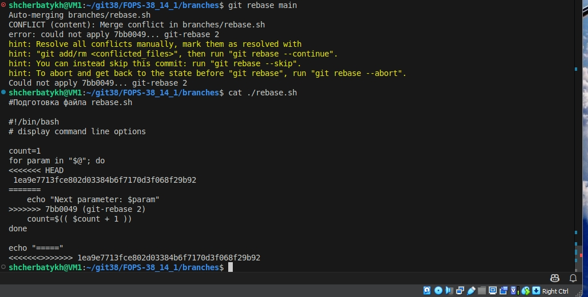
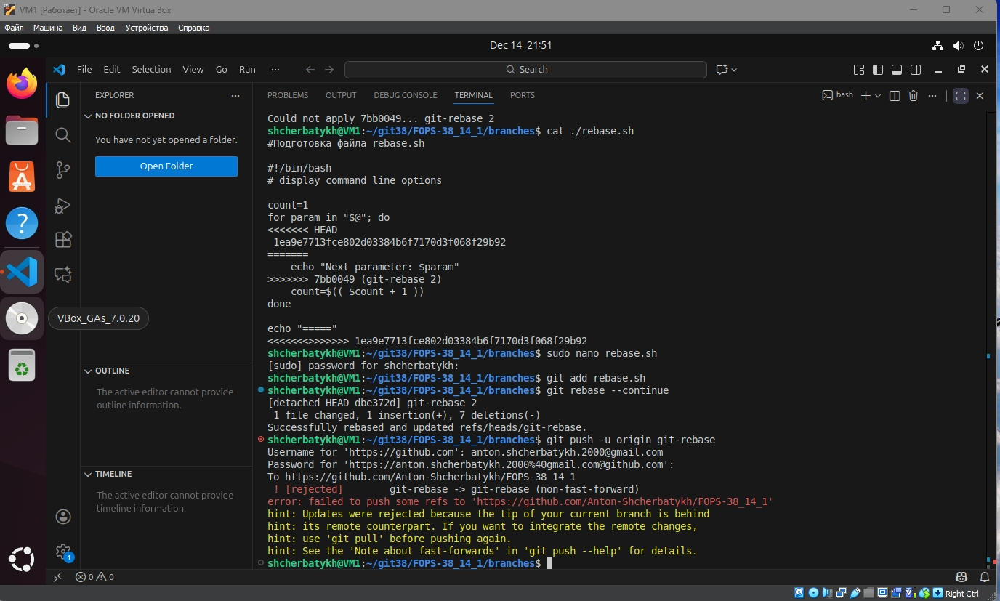
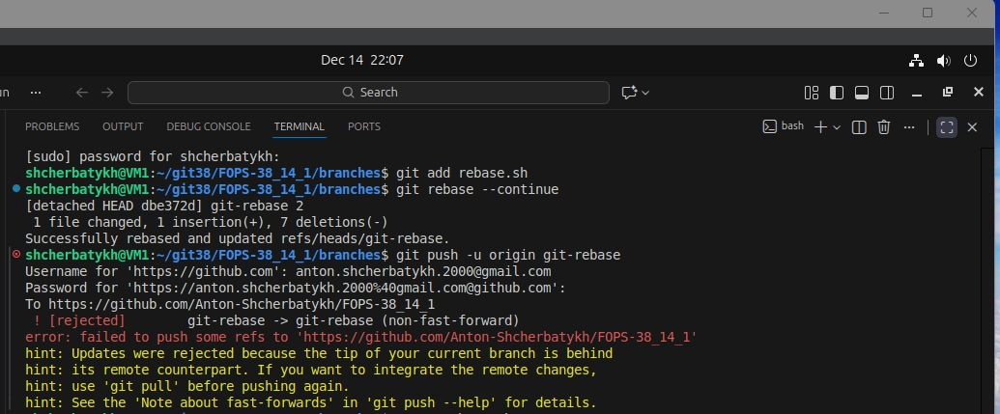
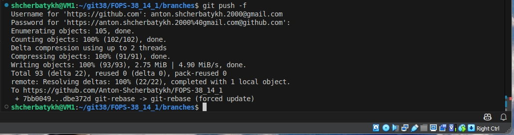
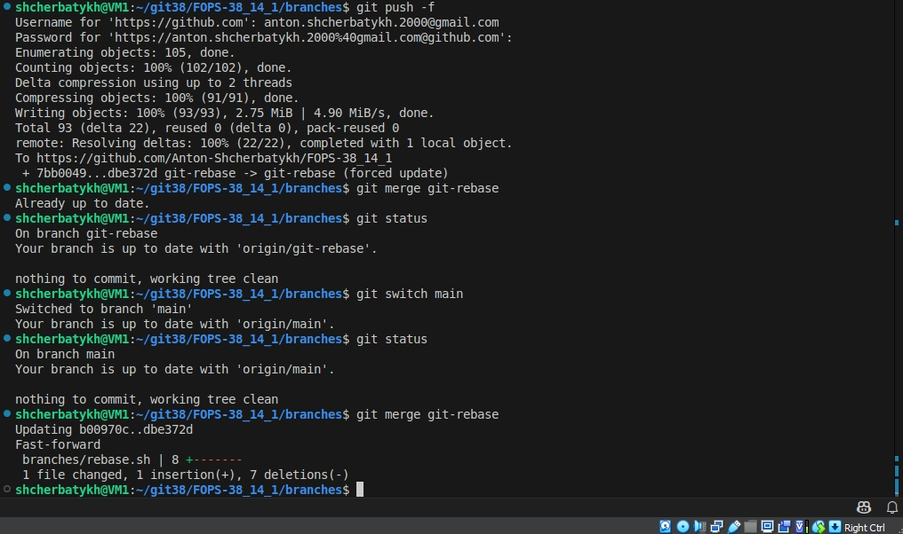

## Домашнее задание к занятию «Ветвления в Git» Щербатых А.Е. FOPS-38

### Задание «Ветвление, merge и rebase» 

**Шаг 1.** Создал каталог branching и файлы merge.sh и rebase.sh


#### Подготовка файла merge.sh
**Шаг 1.** Создал ветку ```git-merge```


**Шаг 2.** Заменил в ней содержимое файла ```merge.sh``` согласно заданию

**Шаг 3.** Создал коммит "merge: @ instead *" и запушил изменения в репозиторий


**Шаг 4.** Вношу ещё одни изменения в файл ```merge.sh```

**Шаг 5.** Создаю коммит ```merge: use shift``` и отправляю изменения в репозиторий:


#### Изменим ```main```

**Шаг 1.** Вернулся в ветку ```main```. (команда отражена на скрине в следующем шаге)

**Шаг 2.** Изменил содержимое файла rebase.sh


**Шаг 3.** Отправил изменения в ветку main:


#### Подготовка файла rebase.sh

**Шаг 1.** С помощью команды git log нахожу хеш коммита ```prepare for merge and rebase``` и выполняю ```git checkout``` на него:


**Шаг 2.** Создаю ветку git-rebase, основываясь на текущем коммите

**Шаг 3.** Изменяю содержимое файла ```rebase.sh``` согласно задания

**Шаг 4.** Отправляю эти изменения в ветку ```git-rebase``` с комментарием ```git-rebase 1```.



**Шаг 5.** Сделал ещё один коммит ```git-rebase 2``` с пушем, заменив ```echo "Parameter: $param"``` на ```echo "Next parameter: $param"```



#### Промежуточный итог

Проверил, что у меня получилось на network странице по ссылке [FOPS-38_14/network](https://github.com/Anton-Shcherbatykh/FOPS-38_14_1/network)


#### Merge
Переключаюсь на ветку ```main```. Сливаю ветку ```git-merge``` в ```main``` и отправляю изменения в репозиторий



Результат тут [FOPS-38_14/network](https://github.com/Anton-Shcherbatykh/FOPS-38_14_1/network)

#### Rebase
**Шаг 1.** и **Шаг 2.** Выполнил rebase ветки git-rebase на main, создав конфликт:



Смотрю содержимое файла rebase.sh и вижу метки, оставленные Git для решения конфликта:



**Шаг 3.** Удаляю метки, выбираю вариант echo "$@ Parameter #$count = $param"

**Шаг 4.** Сообщаю Git, что конфликт решён и продолжаю rebase.



Шаг 5 и 6 пропущен, т.к. конфликт был разрешён

**Шаг 7.** Пытаюсь выполнить пуш и вижу, что команда завершается с ошибкой:



Это происходит потому, что я пытаюсь перезаписать историю.

**Шаг 8.** Пытаюсь выполнить пуш с флагом force и это удается сделать:



**Шаг 9.** Смержу ветку git-rebase в main простой перемоткой:



Проверил, что у меня получилось на network странице по ссылке [FOPS-38_14/network](https://github.com/Anton-Shcherbatykh/FOPS-38_14_1/network)
